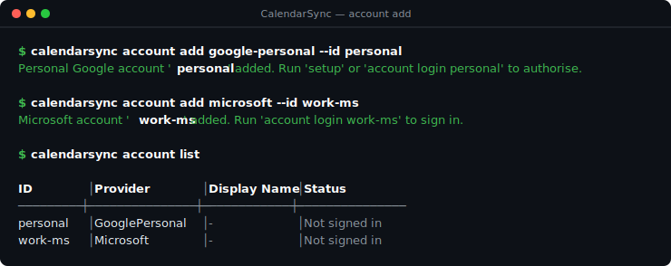
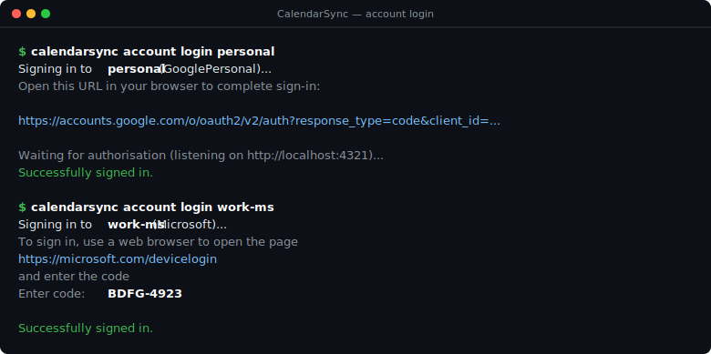
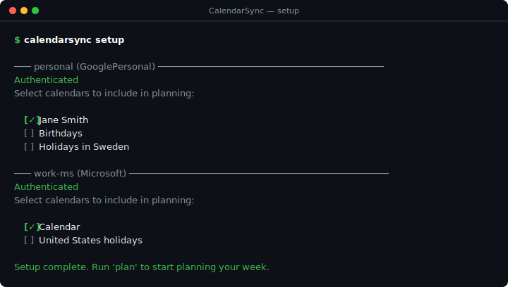
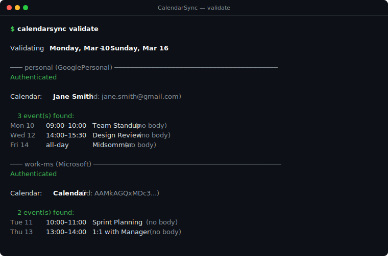
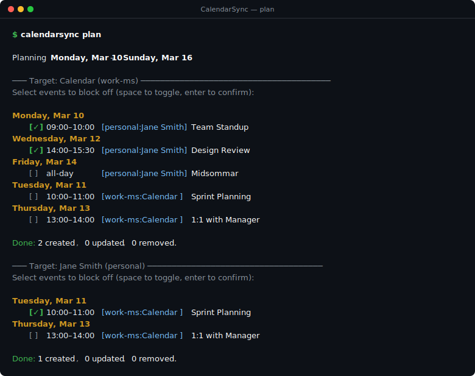

# CalendarSync — Usage Screenshots

This page walks through a complete first-time setup and planning session with CalendarSync.

---

## 1 — Add accounts

Add a personal Google account and a work Microsoft account.  
No credentials are required for personal accounts; both ship with a built-in OAuth client.

```bash
calendarsync account add google-personal --id personal
calendarsync account add microsoft       --id work-ms
calendarsync account list
```



---

## 2 — Log in

Authenticate each account. The Google account opens a local callback listener and prints the
authorisation URL; the Microsoft account uses the device code flow so it works in WSL too.

```bash
calendarsync account login personal
calendarsync account login work-ms
```



---

## 3 — Setup (select calendars)

Run `setup` to verify authentication for every account and interactively pick which calendars
to include in future planning sessions. One calendar is selected per account here.

```bash
calendarsync setup
```



---

## 4 — Validate

Run `validate` to confirm authentication is still active and preview the raw events that
CalendarSync can see in the configured calendars for the coming week.

```bash
calendarsync validate
```



---

## 5 — Plan

Run `plan` to choose which events from one calendar should be blocked off as placeholders
in the other. Use **Space** to toggle items and **Enter** to confirm.
CalendarSync processes each writable target calendar in turn.

```bash
calendarsync plan
```



After confirming, CalendarSync creates placeholder events in the target calendars, tagged
with an `[CalSync: …]` marker so they can be updated or removed automatically on the next run.
